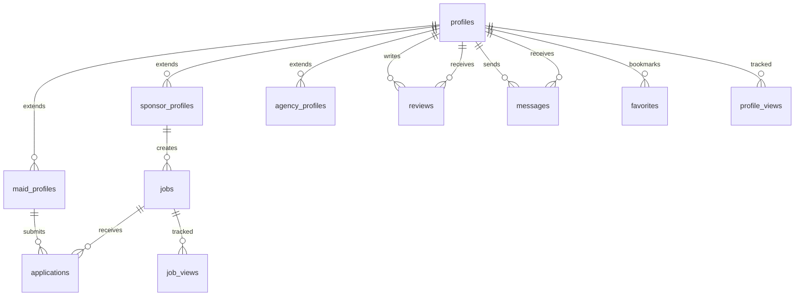

# Ethio-Maids Database Setup Guide

This directory contains the complete database schema and migration files for the Ethio-Maids platform. The database is designed to work with Supabase (PostgreSQL) and includes comprehensive security policies, triggers, and functions.

## 📁 Directory Structure

```
database/
├── README.md                    # This file
├── QUICK_FIX_GUIDE.md          # Quick troubleshooting guide
├── migrations/                  # Database migration files
│   ├── 001_core_schema.sql     # Core tables and user profiles
│   ├── 002_security_policies.sql # Row Level Security policies
│   ├── 003_functions_triggers.sql # Database functions and triggers
│   ├── 004_jobs_applications.sql # Jobs and applications system
│   └── 005_extended_security.sql # Extended security and validation
└── scripts/
    └── setup-database.js       # Automated setup script
```

## 🚀 Quick Setup

### Option 1: Automated Setup (Recommended)

1. **Configure Environment Variables**

   ```bash
   cp .env.example .env
   # Edit .env with your Supabase credentials
   ```

2. **Run the Setup Script**
   ```bash
   node scripts/setup-database.js
   ```

### Option 2: Manual Setup

1. **Open Supabase Dashboard**
   - Go to your Supabase project dashboard
   - Navigate to SQL Editor

2. **Execute Migration Files in Order**
   - Copy and paste each migration file content
   - Execute them in numerical order: 001 → 002 → 003 → 004 → 005

## 📋 Migration Files Overview

### 001_core_schema.sql

**Core Database Foundation**

- User profiles table with role-based structure
- Maid profiles with detailed information
- Sponsor profiles for employers
- Agency profiles for recruitment agencies
- Basic indexes and constraints

**Key Tables:**

- `profiles` - Main user profiles
- `maid_profiles` - Detailed maid information
- `sponsor_profiles` - Employer information
- `agency_profiles` - Agency information

### 002_security_policies.sql

**Row Level Security (RLS)**

- Authentication-based access control
- Role-based data visibility
- Profile privacy protection
- Secure data operations

**Security Features:**

- Users can only access their own data
- Public profile information visibility
- Admin override capabilities
- Secure profile updates

### 003_functions_triggers.sql

**Database Logic and Automation**

- Profile management functions
- Data validation triggers
- Automated timestamp updates
- Search and filtering functions

**Key Functions:**

- `update_updated_at_column()` - Automatic timestamp updates
- `get_maid_profiles()` - Advanced maid search
- `get_sponsor_profiles()` - Sponsor filtering
- Profile validation triggers

### 004_jobs_applications.sql

**Jobs and Applications System**

- Job posting management
- Application tracking
- Reviews and ratings
- Messaging system
- Analytics and views tracking

**Key Tables:**

- `jobs` - Job postings
- `applications` - Job applications
- `reviews` - Rating system
- `messages` - Communication
- `favorites` - Bookmarking
- `job_views` / `profile_views` - Analytics

### 005_extended_security.sql

**Advanced Security and Validation**

- Extended RLS policies for jobs/applications
- Data validation functions
- Business logic enforcement
- Advanced permission checks

**Security Features:**

- Job application permissions
- Message authorization
- Review system security
- Data validation triggers

## 🔧 Environment Variables

Required environment variables in your `.env` file:

```env
# Supabase Configuration
VITE_SUPABASE_URL=your-supabase-project-url
VITE_SUPABASE_ANON_KEY=your-supabase-anon-key

# For database setup script
SUPABASE_SERVICE_KEY=your-supabase-service-role-key

# Toggle between mock and real data
VITE_USE_MOCK_DATA=false
```

## 🔍 Verification Steps

After running the migrations, verify your setup:

### 1. Check Tables

```sql
SELECT table_name
FROM information_schema.tables
WHERE table_schema = 'public'
ORDER BY table_name;
```

Expected tables:

- `profiles`
- `maid_profiles`
- `sponsor_profiles`
- `agency_profiles`
- `jobs`
- `applications`
- `reviews`
- `messages`
- `favorites`
- `job_views`
- `profile_views`

### 2. Test RLS Policies

```sql
-- This should show RLS is enabled
SELECT schemaname, tablename, rowsecurity
FROM pg_tables
WHERE schemaname = 'public' AND rowsecurity = true;
```

### 3. Verify Functions

```sql
-- List custom functions
SELECT routine_name
FROM information_schema.routines
WHERE routine_schema = 'public'
AND routine_type = 'FUNCTION';
```

## 🛠 Troubleshooting

### Common Issues

1. **Permission Errors**
   - Ensure you're using the service role key for setup
   - Check that RLS policies allow your operations

2. **Function Errors**
   - Verify all dependencies are created in order
   - Check for syntax errors in custom functions

3. **Connection Issues**
   - Verify Supabase URL and keys are correct
   - Check network connectivity

### Getting Help

1. **Check the Quick Fix Guide**: `database/QUICK_FIX_GUIDE.md`
2. **Review Migration Logs**: Look for specific error messages
3. **Manual Execution**: Try running individual SQL statements
4. **Supabase Dashboard**: Use the SQL Editor for debugging

## 📊 Database Schema Overview



## 🔐 Security Features

### Row Level Security (RLS)

- **Enabled on all tables** - No data access without proper authentication
- **Role-based access** - Users see only relevant data
- **Profile privacy** - Personal information protected
- **Admin overrides** - Administrative access when needed

### Data Validation

- **Input sanitization** - Prevents invalid data entry
- **Business rules** - Enforces platform rules
- **Referential integrity** - Maintains data consistency
- **Audit trails** - Tracks important changes

### Authentication Integration

- **Supabase Auth** - Seamless integration with authentication
- **JWT tokens** - Secure session management
- **User context** - Functions aware of current user
- **Permission checks** - Granular access control

## 📈 Performance Considerations

### Indexes

- **Primary keys** - Automatic unique indexes
- **Foreign keys** - Relationship indexes
- **Search fields** - Optimized for common queries
- **GIN indexes** - Array and JSON field optimization

### Query Optimization

- **Efficient joins** - Minimized cross-table queries
- **Selective filtering** - Early data reduction
- **Pagination support** - Large dataset handling
- **Caching strategies** - Reduced database load

## 🔄 Migration Management

### Adding New Migrations

1. Create new file: `006_your_feature.sql`
2. Follow naming convention
3. Include rollback instructions in comments
4. Update setup script with new file
5. Test thoroughly before deployment

### Best Practices

- **Incremental changes** - Small, focused migrations
- **Backward compatibility** - Don't break existing data
- **Documentation** - Clear comments and descriptions
- **Testing** - Verify on staging environment first

## 📞 Support

For database-related issues:

1. Check this README and Quick Fix Guide
2. Review Supabase documentation
3. Test queries in SQL Editor
4. Check application logs for specific errors

---

**Last Updated**: December 2024  
**Database Version**: 1.0  
**Compatible with**: Supabase (PostgreSQL 13+)
